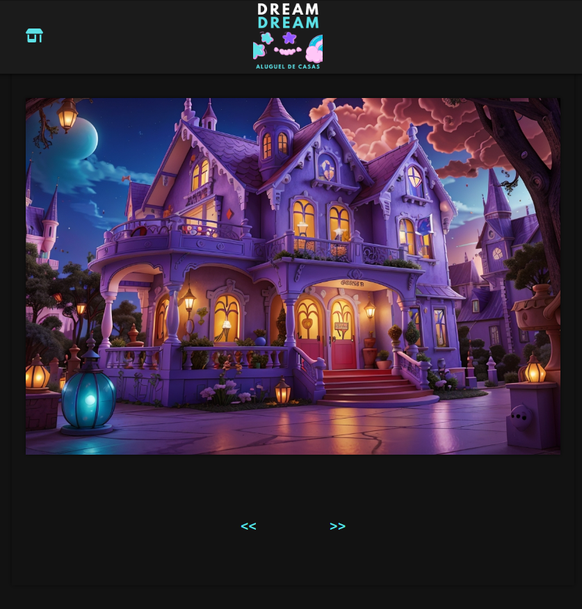

# Projeto de Desenvolvimento Web: Site com Slideshow e Botões de Navegação

Bem-vindo ao repositório do projeto de desenvolvimento web realizado para a aula de Desenvolvimento Web. Neste projeto, criamos um site interativo com um slideshow de imagens e botões de navegação "Antecessor" e "Sucessor".

## Visão Geral do Projeto

Este projeto tem como objetivo demonstrar habilidades essenciais de desenvolvimento web, incluindo HTML, CSS e JavaScript. O site consiste em um slideshow que exibe uma série de imagens em sequência. Os usuários podem navegar pelas imagens utilizando os botões "Antecessor" e "Sucessor" posicionados abaixo do slideshow.

## Funcionalidades Principais

- Slideshow de Imagens: As imagens são exibidas em um formato de slideshow automático. Cada imagem permanece na tela por alguns segundos antes de transicionar suavemente para a próxima.

- Botões de Navegação: Abaixo do slideshow, há dois botões - "Antecessor" e "Sucessor". Os usuários podem clicar nesses botões para navegar manualmente pelas imagens, voltando para a imagem anterior ou avançando para a próxima.

## Tecnologias Utilizadas

- HTML: Estruturamos o conteúdo do site utilizando HTML semântico, garantindo uma base acessível e bem organizada.

- CSS: Estilizamos o layout do site usando CSS para criar uma aparência agradável e responsiva em diferentes dispositivos.

- JavaScript: Implementamos a funcionalidade do slideshow e dos botões de navegação utilizando JavaScript para criar uma experiência interativa e fluida.

## Projeto

##LINK
https://legendary-mandazi-547880.netlify.app

